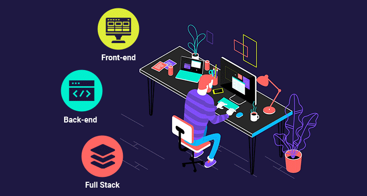

  

<h1 align="center">Abdul Wahab</h1>

  <strong>Full Stack Engineer · MERN · Next.js · Django</strong>

  
  &nbsp;
  
  &nbsp;
  
  &nbsp;
  
  &nbsp;
  

---

## About

Software Engineer specialising in Full-Stack Web Development with a strong command of the MERN stack, Next.js, and Django. I build scalable, performant web applications — from thoughtful frontend experiences to robust backend architectures — with a focus on clean code and measurable impact.

- 🔭 Currently building production-grade applications with **Next.js** and **Django**
- 🌱 Deepening expertise in **system design**, **PostgreSQL optimisation**, and **cloud infrastructure**
- 💡 Interested in open-source collaboration and performance-driven engineering
- 📫 Reach me at [wahabcreation2161@gmail.com](mailto:wahabcreation2161@gmail.com)

---

## Tech Stack

### Frontend

### Backend

### Infrastructure & Tools

---

## Featured Projects

| Project | Description | Stack | Live |
|--------|-------------|-------|------|
| **Quran Academia** | Online Quran learning platform with scheduling & student management | React, Next.js, Django, PostgreSQL | [→ View](https://mwquranacademy.vercel.app/) |
| **Capital Management System** | Business capital & investment tracking dashboard | React, Next.js, Django, PostgreSQL | [→ View](https://pms-cust.vercel.app) |
| **Savemore** | E-commerce savings and deals platform | React, Next.js, Django, PostgreSQL | [→ View](https://savemore.cloud) |
| **Zee Security** | Corporate security services website | React, Django, PostgreSQL | [→ View](https://zeesecurity.co.uk) |
| **LTI** | Integrated Technology Institute landing & portal | React, Next.js | [→ View](https://thelti.site) |
| **Raw Editor** | Online raw text & code editing tool | React, Next.js | [→ View](https://raw-editor.vercel.app) |
| **Matchwise AI** | AI-powered matchmaking web application | React, Next.js | [→ View](https://matchwise-ai.com) |
| **Eizkm** | Industrial spare parts & power solutions platform | React, Django, PostgreSQL | [→ View](https://eizkm.com) |
| **Portfolio** | Personal developer portfolio | React | [→ View](https://wahabcreations.vercel.app) |

---

## GitHub Analytics

  
  &nbsp;
  

  

  

---

## Open To

- **Full-Stack Development** roles (MERN / Next.js / Django)
- **Frontend Engineering** positions (React / TypeScript)
- **Freelance & Contract** projects
- **Open Source** contributions
- **Internship** opportunities

---

  <em>Let's build something great together.</em>
    
  

